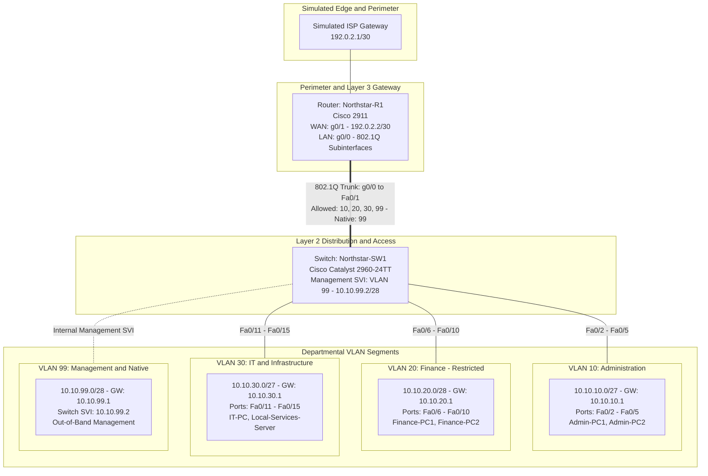

# CCNA Networking Lab: Multi-VLAN Small Business Architecture

[](checklist.md)
[](https://www.netacad.com/)
[](docs/)
[](https://www.cisco.com/)

A documented, simulation-based networking project modeling a multi-department enterprise network in **Cisco Packet Tracer**. This project translates Cisco Certified Network Associate (CCNA) principles into practical, verifiable evidence of network architecture design, IP subnetting, VLAN segmentation, inter-VLAN routing, and hypothesis-driven troubleshooting.

> **Authenticity Disclaimer:**  
> This project models a **fictional small-to-medium business (SMB)** scenario named **Northstar Services**. It is a personal laboratory simulation and technical documentation portfolio project. No physical hardware, enterprise production infrastructure, or client networks are claimed. All milestones are tracked transparently as **Completed (Design)**, **In Progress**, or **Planned (Simulation)** in [`checklist.md`](checklist.md).

---

## Table of Contents
* [Scenario & Business Requirements](#scenario--business-requirements)
* [Technical Objectives](#technical-objectives)
* [Tools & Technologies](#tools--technologies)
* [Network Architecture & Topology](#network-architecture--topology)
* [IP Addressing & VLSM Subnetting](#ip-addressing--vlsm-subnetting)
* [VLAN Segmentation & Switchport Map](#vlan-segmentation--switchport-map)
* [Inter-VLAN Routing & Gateway Design](#inter-vlan-routing--gateway-design)
* [Foundational Security Baseline](#foundational-security-baseline)
* [Systematic Troubleshooting Methodology](#systematic-troubleshooting-methodology)
* [Laboratory Progression & Status](#laboratory-progression--status)
* [Evidence Standard](#evidence-standard)
* [Career Alignment](#career-alignment)
* [Repository Structure](#repository-structure)

---

## Scenario & Business Requirements

**Northstar Services** is a small business supporting 30–50 users across three core operational departments:

| Department | Business Function | Endpoint Capacity | Security & Isolation Need |
|---|---|:---:|---|
| **Administration** | Daily operations, front desk, management | 15–20 hosts | General business data; access to local services and Internet |
| **Finance** | Payroll, financial records, accounting | 8–12 hosts | High sensitivity; restricted from general departmental traffic |
| **IT & Infrastructure** | Systems administration, internal testing | 7–18 hosts | Administrative authority; permitted management access |
| **Management Plane** | Switch SVI, router administrative interfaces | 2–6 devices | Isolated out-of-band management network |

---

## Technical Objectives

1. **Logical Network Segmentation:** Implement dedicated VLANs to restrict broadcast domains and isolate departmental traffic at Layer 2.
2. **Efficient Address Engineering:** Implement RFC 1918 private IPv4 addressing with Variable Length Subnet Masking (VLSM) sized to departmental requirements with room for growth.
3. **Layer 3 Routing Core:** Configure Router-on-a-Stick (ROAS) on a Cisco router using 802.1Q subinterfaces for controlled inter-VLAN traffic.
4. **Automated IP Management:** Configure centralized Cisco IOS DHCP scopes with address exclusions for static infrastructure.
5. **Switch & Device Hardening:** Establish a Layer 2 security baseline including port security (MAC address limiting), disabling unused ports, and SSHv2 remote management.
6. **Hypothesis-Driven Troubleshooting:** Inject, diagnose, and resolve three controlled faults following an 8-stage diagnostic process aligned with the OSI model.

---

## Tools & Technologies

* **Simulation Platform:** Cisco Packet Tracer 8.x
* **Networking Hardware Simulated:**
  * Router: Cisco 2911 / 1941 Integrated Services Router (`Northstar-R1`)
  * Switch: Cisco Catalyst 2960-24TT Layer 2 Switch (`Northstar-SW1`)
* **Core Protocols & Concepts:** IPv4, VLSM, ARP, ICMP, 802.1Q encapsulation, Router-on-a-Stick, Cisco IOS DHCP Server, Port Security, SSHv2.
* **Documentation & Design:** Mermaid diagrams, Markdown documentation, Git version control.

---

## Network Architecture & Topology

The network features a centralized router providing inter-VLAN routing and edge connectivity, connected via an 802.1Q trunk link to a Catalyst 2960 switch that distributes connectivity to endpoints across dedicated access VLANs.



*For complete topological explanations and physical port maps, see [`diagrams/network-topology.md`](diagrams/network-topology.md).*

---

## IP Addressing & VLSM Subnetting

The private block `10.10.0.0/16` is subnetted using VLSM to match the specific host capacity of each business unit:

| VLAN | Role | Subnet | Mask | Usable Host Range | Gateway | Broadcast | Usable Hosts | Planned Capacity |
|:---:|---|---|---|---|---|---|:---:|:---:|
| **10** | Administration | `10.10.10.0/27` | `255.255.255.224` | `10.10.10.1` – `10.10.10.30` | `10.10.10.1` | `10.10.10.31` | 30 | 15–20 hosts |
| **20** | Finance | `10.10.20.0/28` | `255.255.255.240` | `10.10.20.1` – `10.10.20.14` | `10.10.20.1` | `10.10.20.15` | 14 | 8–12 hosts |
| **30** | IT & Support | `10.10.30.0/27` | `255.255.255.224` | `10.10.30.1` – `10.10.30.30` | `10.10.30.1` | `10.10.30.31` | 30 | 7–18 hosts |
| **99** | Management | `10.10.99.0/28` | `255.255.255.240` | `10.10.99.1` – `10.10.99.14` | `10.10.99.1` | `10.10.99.15` | 14 | 2–6 devices |
| **—** | Simulated WAN | `192.0.2.0/30` | `255.255.255.252` | `192.0.2.1` – `192.0.2.2` | `192.0.2.1` | `192.0.2.3` | 2 | Point-to-Point |

*Detailed calculations and DHCP scope designs are documented in [`docs/ip-addressing-plan.md`](docs/ip-addressing-plan.md).*

---

## VLAN Segmentation & Switchport Map

| Port Range | Interface Mode | Assigned VLAN | Destination / Purpose | Security Profile |
|---|---|---|---|---|
| `Fa0/1` | 802.1Q Trunk | `10, 20, 30, 99` | Uplink to Router `Northstar-R1` (`g0/0`) | Native VLAN 99; DTP disabled |
| `Fa0/2 - Fa0/5` | Access | VLAN 10 (`ADMIN`) | Administration PC workstations & printer | Port security (max 2, sticky, restrict) |
| `Fa0/6 - Fa0/10` | Access | VLAN 20 (`FINANCE`) | Accounting & financial analyst PCs | Port security (max 2, sticky, restrict) |
| `Fa0/11 - Fa0/15` | Access | VLAN 30 (`IT`) | IT support workstations & testing server | Port security (max 2, sticky, restrict) |
| `Fa0/16 - Fa0/24` | Access | VLAN 999 (`BLACKHOLE`)| Unused physical switchports | Parked in blackhole VLAN & shut down |
| `Gi0/1 - Gi0/2` | Access | VLAN 999 (`BLACKHOLE`)| Unused high-speed interfaces | Parked in blackhole VLAN & shut down |

*Full switchport security rationale and trunk hardening details are in [`docs/vlan-plan.md`](docs/vlan-plan.md).*

---

## Inter-VLAN Routing & Gateway Design

Inter-VLAN routing is accomplished via **Router-on-a-Stick (ROAS)** on `Northstar-R1` over physical interface `g0/0`:
* `g0/0.10` — Encapsulation `dot1Q 10` | IP: `10.10.10.1/27`
* `g0/0.20` — Encapsulation `dot1Q 20` | IP: `10.10.20.1/28`
* `g0/0.30` — Encapsulation `dot1Q 30` | IP: `10.10.30.1/27`
* `g0/0.99` — Encapsulation `dot1Q 99 native` | IP: `10.10.99.1/28`

This design enables centralized routing policy enforcement and serves as the foundation for future traffic filtering Access Control Lists (ACLs).

---

## Foundational Security Baseline

The network implements foundational Layer 2 and management plane hardening controls documented in [`docs/security-baseline.md`](docs/security-baseline.md):
1. **Unused Port Parking:** All unused switchports are assigned to an unrouted blackhole VLAN (999) and administratively shut down.
2. **Port Security:** Access ports enforce MAC limiting (maximum 2 MACs) with dynamic sticky learning and violation mode set to `restrict`.
3. **Trunk Hardening:** Dynamic Trunking Protocol (DTP) is explicitly disabled with `switchport nonegotiate`. The default native VLAN is changed from VLAN 1 to dedicated VLAN 99 to mitigate VLAN hopping.
4. **Secure Management Plane:** Telnet is disabled globally. Remote administration requires SSHv2 with 2048-bit RSA keys, local credential authentication, VTY timeouts, and encrypted secrets.

---

## Systematic Troubleshooting Methodology

To develop methodical diagnostic habits, troubleshooting follows an 8-stage hypothesis-driven diagnostic loop aligned with the OSI model:

$$\text{Identify Symptom} \longrightarrow \text{Gather Baseline} \longrightarrow \text{Formulate Hypothesis} \longrightarrow \text{Isolate} \longrightarrow \text{Fix} \longrightarrow \text{Verify} \longrightarrow \text{Document}$$

### Planned Controlled Fault Exercises:
* **Fault 01 (Layer 2):** Access port VLAN mismatch on an administrative workstation.
* **Fault 02 (Layer 2 Trunk):** Omission of VLAN 30 on the 802.1Q trunk allowed list.
* **Fault 03 (Layer 3 Routing):** Subinterface encapsulation tag misconfiguration on Router R1.

*Full diagnostic procedures and case logs are documented in [`docs/troubleshooting-log.md`](docs/troubleshooting-log.md).*

---

## Laboratory Progression & Status

| Lab Guide | Focus Area | Status | Deliverable |
|---|---|---|---|
| [`labs/01-basic-switching.md`](labs/01-basic-switching.md) | Switching fundamentals, MAC learning, frame forwarding | **Simulation Ready** | Verification logs, MAC table capture |
| [`labs/02-vlans-and-trunks.md`](labs/02-vlans-and-trunks.md) | VLAN segmentation, 802.1Q trunking, native VLAN | **Simulation Ready** | `show vlan brief`, `show interfaces trunk` |
| [`labs/03-inter-vlan-routing.md`](labs/03-inter-vlan-routing.md) | Router-on-a-Stick subinterfaces, gateway verification | **Simulation Ready** | `show ip route`, cross-VLAN ICMP traces |
| [`labs/04-dhcp.md`](labs/04-dhcp.md) | Cisco IOS DHCP pools, exclusions, dynamic leases | **Simulation Ready** | `show ip dhcp binding`, client lease logs |
| [`labs/05-troubleshooting.md`](labs/05-troubleshooting.md) | Controlled fault injection, root cause analysis | **Simulation Ready** | Before/after logs, investigation records |
| [`labs/06-security-baseline.md`](labs/06-security-baseline.md) | Switchport security, unused port parking, SSHv2 | **Simulation Ready** | Port security status, SSH session logs |

---

## Evidence Standard

As labs are executed in Packet Tracer, all technical artifacts will be organized in [`evidence/`](evidence/):
* `evidence/screenshots/`: Topology overviews, ping test confirmations, DHCP configuration screens.
* `evidence/configs/`: Sanitized running configurations (`SW1`, `R1`) with passwords and secrets removed.
* `evidence/logs/`: Raw terminal verification output (`show interfaces trunk`, `show ip route`, etc.).

---

## Career Alignment

This repository demonstrates foundational technical competencies mapped directly to entry-level IT infrastructure and security positions:
* **Network Support & IT Operations:** IP subnetting, physical-to-logical port mapping, DHCP lease troubleshooting, Layer 1–3 fault isolation.
* **Junior Systems & Network Administration:** Cisco IOS configuration, 802.1Q trunking, management plane access control, technical runbook documentation.
* **SOC Analyst (Tier 1) & Security Engineering Foundations:** Layer 2 attack surface reduction (DTP, port security, VLAN hopping mitigation), baseline hardening, and structured root-cause analysis.

---

## Repository Structure

```text
├── README.md                      # Project overview, architecture, and navigation
├── checklist.md                   # Detailed project progression tracking
├── LICENSE                        # MIT License
├── diagrams/
│   ├── README.md                  # Visual assets overview
│   └── network-topology.md        # Detailed topology and Layer 2/3 domain analysis
├── docs/
│   ├── network-requirements.md    # Business context and functional requirements
│   ├── ip-addressing-plan.md      # VLSM subnet calculations and DHCP designs
│   ├── vlan-plan.md               # VLAN segmentation and port allocation matrix
│   ├── security-baseline.md       # Switch and router hardening standards
│   ├── troubleshooting-log.md     # 8-stage methodology and fault investigation records
│   └── final-report.md            # Final project report template
├── labs/
│   ├── 01-basic-switching.md      # Lab 01: Switching & MAC learning
│   ├── 02-vlans-and-trunks.md     # Lab 02: VLANs, access ports, and trunks
│   ├── 03-inter-vlan-routing.md   # Lab 03: Router-on-a-Stick configuration
│   ├── 04-dhcp.md                 # Lab 04: Centralized Cisco IOS DHCP services
│   ├── 05-troubleshooting.md      # Lab 05: Controlled fault exercises
│   └── 06-security-baseline.md    # Lab 06: Port security and management plane hardening
└── evidence/
    ├── README.md                  # Artifact guidelines and sanitization policy
    ├── screenshots/               # Verified visual outputs (.gitkeep)
    ├── configs/                   # Sanitized device configurations (.gitkeep)
    └── logs/                      # Terminal command verification logs (.gitkeep)
```
