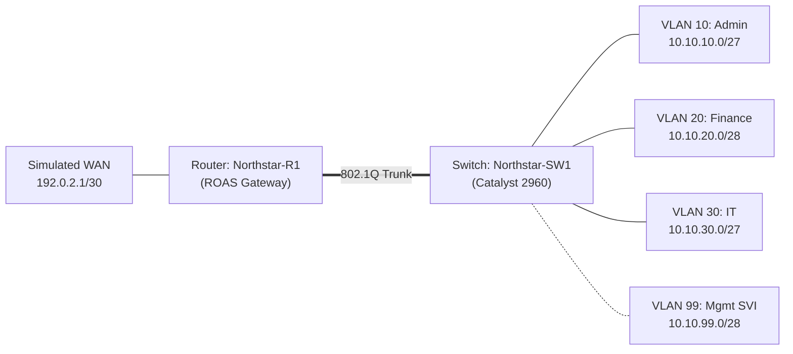

# Network Topology & Visual Assets

**Status: Planned Architecture / Design Documentation**

This directory houses the logical architecture, diagram source files, and visual exports for the CCNA Networking Lab project.

---

## Architecture Diagram

The logical network architecture is documented in detail in [`network-topology.md`](network-topology.md).

---

## Included Files & Asset Guidelines

* [`network-topology.md`](network-topology.md) — Comprehensive technical breakdown of the Layer 2/3 topology, interface assignments, and broadcast domains.
* `network-topology.drawio` *(Planned)* — Editable XML source file created in diagrams.net / draw.io.
* `network-topology.png` *(Planned)* — High-resolution exported image for external documentation and PDF reports.

> **Authenticity Note:** The diagram above reflects the planned engineering design. When Packet Tracer topology files (`.pkt`) and screenshots are produced during lab execution, corresponding screenshots will be added to `evidence/screenshots/`.
