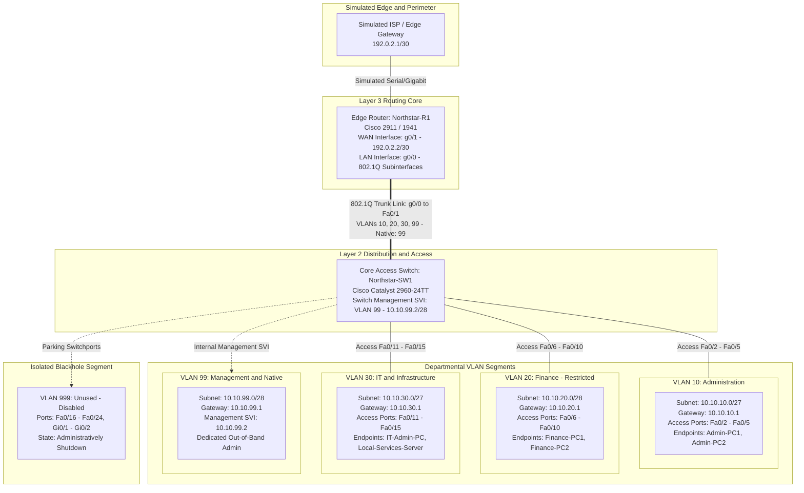

# Network Architecture & Topology

**Status: Planned Architecture / Design Baseline**  
*Simulation Environment: Cisco Packet Tracer*

---

## 1. Architectural Overview

The Northstar Services network architecture is designed as a modular, segmented Layer 2 and Layer 3 topology suitable for a small-to-medium business (SMB) supporting 30–50 users across three primary departments: **Administration**, **Finance**, and **IT & Technical Services**, plus a dedicated **Management network**.

To maintain logical isolation, enhance traffic control, and contain broadcast domains, each functional unit is allocated its own dedicated Virtual Local Area Network (VLAN) and IPv4 subnet according to RFC 1918.

---

## 2. Logical Topology Diagram

---

## 3. Layer 2 Domain & Switchport Mapping

The Cisco Catalyst 2960 switch (`Northstar-SW1`) provides high-density Layer 2 switching. Ports are mapped strictly by departmental policy:

| Switchport Range | Configured Mode | VLAN Assignment | Connected Endpoints / Role | Security Stance |
|---|---|---|---|---|
| `FastEthernet 0/1` | 802.1Q Trunk | Allowed: 10, 20, 30, 99 | Uplink to Router `Northstar-R1` (g0/0) | Native VLAN 99; DTP disabled (`nonegotiate`) |
| `FastEthernet 0/2 - 0/5` | Access | VLAN 10 (Admin) | Administrative workstations & reception | Port security enabled (max 2 MACs, sticky) |
| `FastEthernet 0/6 - 0/10` | Access | VLAN 20 (Finance) | Financial analysts & accounting workstations | Port security enabled; restricted departmental segment |
| `FastEthernet 0/11 - 0/15` | Access | VLAN 30 (IT) | Systems admin workstations, local test server | Port security enabled; administrative endpoints |
| `FastEthernet 0/16 - 0/24` | Access | VLAN 999 (Blackhole) | Unused physical ports | Administratively shut down (`shutdown`) |
| `GigabitEthernet 0/1 - 0/2` | Access | VLAN 999 (Blackhole) | Unused high-speed ports | Administratively shut down (`shutdown`) |

---

## 4. Layer 3 Routing & Perimeter Architecture

Inter-VLAN traffic is managed by `Northstar-R1` using a **Router-on-a-Stick (ROAS)** design across a single physical GigabitEthernet link (`g0/0`) divided into virtual subinterfaces:

* **`GigabitEthernet 0/0.10`**: Default gateway for VLAN 10 (`10.10.10.1/27`)
* **`GigabitEthernet 0/0.20`**: Default gateway for VLAN 20 (`10.10.20.1/28`)
* **`GigabitEthernet 0/0.30`**: Default gateway for VLAN 30 (`10.10.30.1/27`)
* **`GigabitEthernet 0/0.99`**: Default gateway for Management VLAN 99 (`10.10.99.1/28`)
* **`GigabitEthernet 0/1`**: Simulated WAN / Edge connection to ISP (`192.0.2.2/30`)

### Routing Policy & Security Boundary
1. **Inter-VLAN Communication:** Default routing table routes between all subinterfaces. In subsequent phases, Access Control Lists (ACLs) will restrict VLAN 10 (Admin) and guest traffic from accessing VLAN 20 (Finance) and management SVIs.
2. **Management Plane Isolation:** Switch management is contained within VLAN 99. The SVI is reachable only through routed access, enabling future filtering so only VLAN 30 (IT) can open SSH sessions to `10.10.99.2`.
